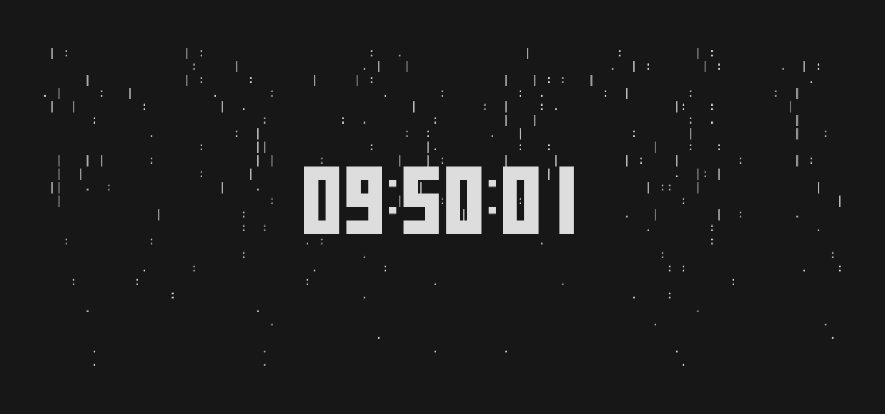

# Tenki

tty-clock with weather effect written by Rust and powerd by [ratatui](https://github.com/ratatui-org/ratatui)



## Installation

### Install from Cargo

```
cargo install --git https://github.com/ckaznable/tenki.git
```

### Install from Source Code

tenki is written in Rust, so you'll need to grab a [Rust installation](https://www.rust-lang.org/) in order to compile it.

```shell
git clone https://github.com/ckaznable/tenki
cd tenki
make build
make install
```

If you want to uninstall

```shell
make uninsall
```

### Install from the AUR

If you are using Arch Linux, you can install tenki using an [AUR helper](https://wiki.archlinux.org/title/AUR_helpers). For example:

```shell
paru -S tenki
```

## Usage

```
Usage: tenki [OPTIONS]

Options:
      --mode <MODE>    [default: rain] [rain, snow]
      --fps <FPS>      [default: 30] [1-60]
      --color <COLOR>  Timer color [default: white] [red, green, blue, yellow, cyan, magenta, white, black]
      --wind <WIND>    Decide on the direction of the rain/snow [defualt: random] [random, disable, only-right, only-left]
  -l, --level <LEVEL>  Effect level, The lower, the stronger [default: 50] [4-1000]
  -h, --help           Print help
  -V, --version        Print version
```

## Roadmap

- [x] CLI options
- [ ] customizable

## LICENSE

[MIT](./LICENSE)

